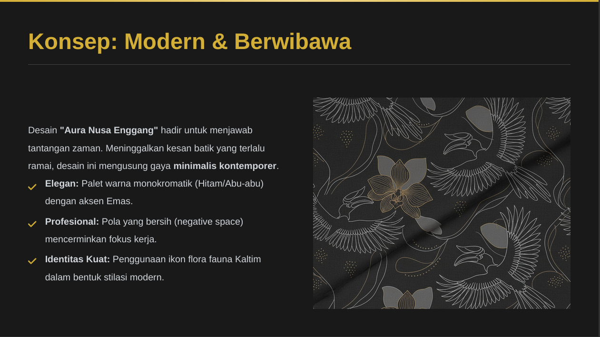
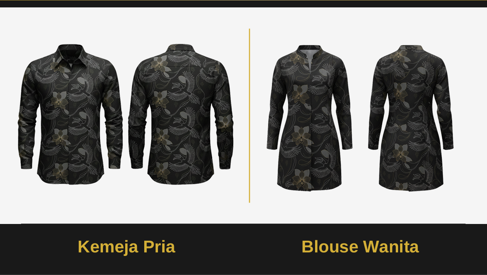

# Desain Seragam Batik ASN Kaltim – "Aura Nusa Enggang"

Desain **"Aura Nusa Enggang"** menginterpretasikan identitas **Benua Etam** secara modern dan berwibawa dengan gaya **minimalis kontemporer**. Desain ini menggunakan palet **monokromatik (Hitam/Abu-abu) dengan aksen emas**, menampilkan elemen visual yang elegan dan simbolik.

## Preview Desain

## Elemen Visual Utama
- **Siluet Enggang**: Melambangkan kepemimpinan dan visi jauh ke depan.  
- **Anggrek Hitam**: Simbol keunikan, integritas, dan nilai lokal yang berharga.  
- **Alur Dinamis**: Garis abstrak yang merepresentasikan aliran Sungai Mahakam dan konektivitas digital.

## Pola & Estetika
- **Pola scattered (tersebar)** memberikan ruang napas visual.  
- Menciptakan kesan **ramping, profesional, dan timeless**.  
- Mudah dipadukan dengan bawahan gelap.

## Makna Filosofis & Nilai ASN
- **Visioner & Kepemimpinan**: Burung Enggang sebagai simbol transformasi.  
- **Integritas & Jati Diri**: Anggrek Hitam menegaskan keunikan dan nilai lokal.  
- **Profesionalisme**: Ruang negatif dan pola bersih mencerminkan fokus dan efektivitas kerja.

> Desain ini diharapkan menjadi **identitas baru ASN Provinsi Kalimantan Timur**, memadukan **keanggunan, profesionalisme, dan kekuatan budaya lokal**.

